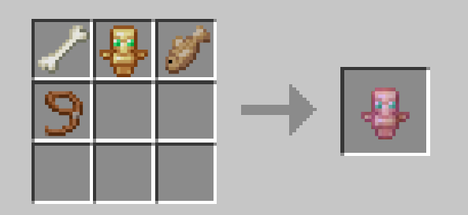

# Pet Totem Datapack

A totem that keeps your loyal friend safe.

## Introduction

This datapack allows the player to craft a totem that can be given to a pet, which will save him of a deadly hit.

## Installation

Place the ```.zip``` in your world's ```datapacks``` folder

## Use

- If you don't have the recipe use the ```/reload``` command to obtain it
- Then craft the totem:
  - Cod can be replaced with raw salmon
  - The craft is shapeless, it doesn't matter the order you put the items

- When facing to your pet while being near it, hold right click
  - You will see a golden heart particle
  - After 3 seconds it will consume the totem and give it to your pet
  - The pet will glow and have a golden heart on his head for 5 seconds, meaning it has obtained the totem
- If you try to use the totem while no allowed mob are near you, you will get a message and the totem won't be consumed
- Use the ```/trigger .pet_totem_check_pets``` to see in a 10 block radius all the pets that have a totem.

[Mobs that can have the totem](https://minecraft.wiki/w/Taming/#List_of_mobs)

## Demonstration

### Totem


### Trigger Command


## Compatibility

This datapack works in +1.21.6
